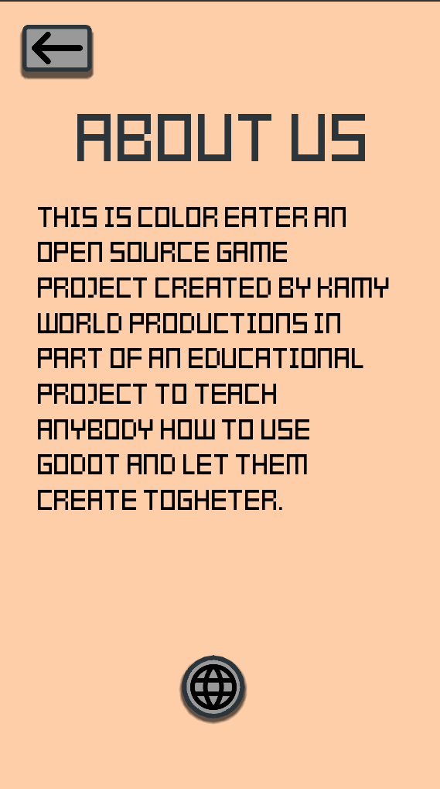

# Color Eater

**Status:** Demo Project

**Current Phase:** Demo

**Version** 1.3.0

## The Project

A simple demo project for mobile games in Godot called Color Eater. It is there for it to be used as a reference project on mobile game creation. This project showcases how to achieve many features in Godot.

Features:

UI, Score System, Character Selection System, Button System/Animation, Music/Sound-Effects/Vibration Toggles, Scene changes and a simple game with particle system for you to understand the game loop and how those informations are saved on mobile.

## Screenshots

## Game Description

**Disclaimer:** The Project is shaped by you guys, so anything is possible, but for such project to come to an end we have to set some rules and goals. Give suggestions and shape this project from the beginning.

## Technical Details

**Platforms:** Android and IOS

**Art:** 2D

**Renderer:** GLES 2.0 (OpenGL ES 2.0)

**Game Engine:** Godot (3.4.5)

## Rules

Open an issue and add the right tag if you have questions, problems and suggestions. If you have found a bug, describe it in detail and try to give solutions.

## License

MIT
